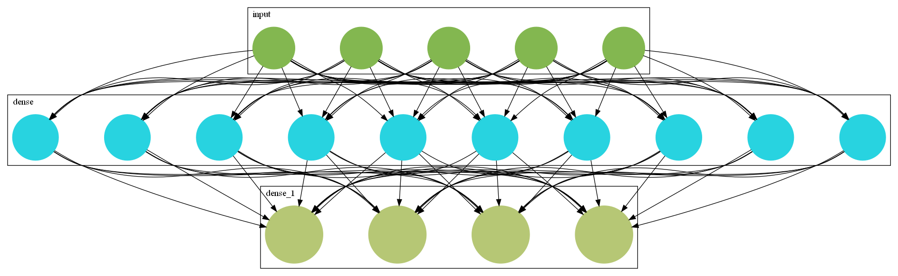

# dViz
A Visualization Library for Deep Learning.

This library will enable you to visualize your neural network architectures.

<!-- TABLE OF CONTENTS -->
## Table of Contents

* [About the Project](#about-the-project)
  * [Built With](#built-with)
* [Getting Started](#getting-started)
  * [Installation](#installation)
* [Usage](#usage)
* [License](#license)
* [Contact](#contact)


<!-- ABOUT THE PROJECT -->
## About The Project


### Built With
This application was built using the following Libraries.
* [Graphviz](https://graphviz.readthedocs.io/en/stable/index.html)
* [Tensorflow](https://www.tensorflow.org/)
* [Keras](https://keras.io/)


<!-- GETTING STARTED -->
## Getting Started

To start visualizing your models, get a local copy up and running follow these simple steps.


### Installation

1. Clone the repo
```sh
git clone https://github.com/Shanks0465/dViz.git
```
2. Install the required libraries. 
```sh
pip install graphviz keras
```
3. Run setup.py
```sh
python setup.py install
```


<!-- USAGE EXAMPLES -->
## Usage

1. Import Libraries
```sh
from tensorflow.keras import datasets, layers, models, losses
from dViz import *
```

2. Define Dense Model. 
```sh
model = models.Sequential()
model.add(layers.Input(shape=(5,)))
model.add(layers.Dense(10, activation='relu'))
model.add(layers.Dense(4))
```

3. Visualize Model! (Easy as that)
```sh
viewSimpleNN(model,"SimpleNN",spline=True,cluster=True,labelled=True,colored=True)

## or

visualize_architecture(model,"SimpleNN_Arch")
```




<!-- LICENSE -->
## License

Distributed under the MIT License. See `LICENSE` for more information.


<!-- CONTACT -->
## Contact

Your Name - [Umashankar](https://www.linkedin.com/in/shankar-kumar-74a228146/) - umashanks99@gmail.com

Project Link: [dViz](https://github.com/Shanks0465/dViz)
